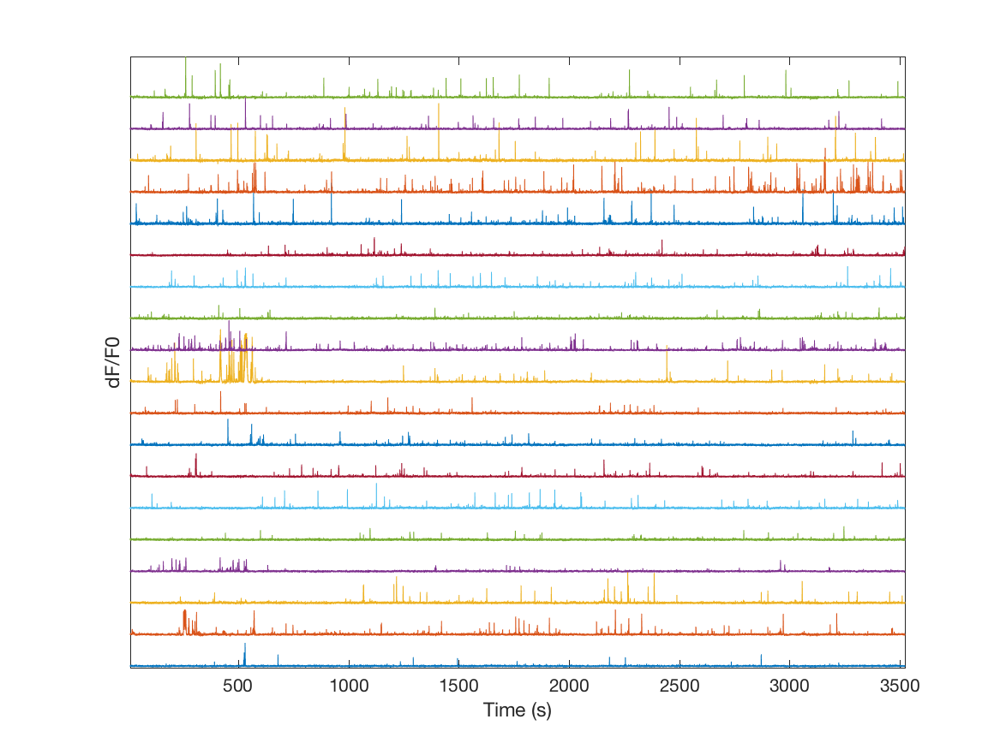
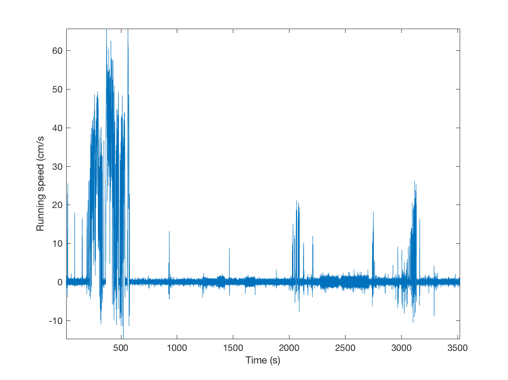

# Brain-Observatory-Toolbox
A MATLAB toolbox for interacting with the [Allen Brain Observatory](http://observatory.brain-map.org/visualcoding)

## Installation

Clone the Brain Observatory Toolbox repository using `git`, or download a release as a `.zip` file. Add the base directory to the `matlab` path; *do not* add the directory `+bot` to the matlab path.

#### Additional requirements

Some aspects of the toolbox make use of accelerated `.mex` files, and therefore require `mex` to be configured. These files will be compiled automatically when needed; if `mex` is not available, then `matlab` native versions will be used.

#### Privacy information

We track the usage of this toolbox along with some demographics using the Google Analytics API, for us to understand the demand for the toolbox.

## Getting started

The toolbox classes are contained within the `bot` namespace within matlab. Once the toolbox is added to the `matlab` path, you can access the main classes:

`bot.sessionfilter` — Retrieve and manage lists of available experimental sessions, filtering them by various experimental parameters.

`bot.session` — Encapsulate, manage and access data for a single experimental season.

`bot.cache` — Internal class that manages caching of experimental data.

## Example usage

Create a session filter object, using the `bot.sessionfilter` class. Since this is the first time we have used the toolbox, the manifest of all experimental data is downloaded from the Allen Brain Observatory.

````matlab
>> bosf = bot.sessionfilter()
Downloading Allen Brain Observatory manifests...
bosf = 
  sessionfilter with properties:

    filtered_session_table: [543x15 table]
                  stimulus: {9x1 cell}
        targeted_structure: {6x1 cell}
             imaging_depth: [10x1 double]
              container_id: [181x1 double]
                session_id: [543x1 double]
              session_type: [543x1 categorical]
                  cre_line: {6x1 cell}
        eye_tracking_avail: [2x1 logical]
                    failed: 0
````

Let's look at what targetted cortical structures are available to analyse, then filter the available sessions to select only the data from primary visual cortex (`'VISp'`).

````matlab
>> bosf.targeted_structure
ans = 
    'VISal'
    'VISam'
    'VISl'
    'VISp'
    'VISpm'
    'VISrl'
>> bosf.filter_sessions_by_targeted_structure('VISp')
ans = 
  sessionfilter with properties:

    filtered_session_table: [138x15 table]
                  stimulus: {9x1 cell}
        targeted_structure: {'VISp'}
             imaging_depth: [6x1 double]
              container_id: [46x1 double]
                session_id: [138x1 double]
              session_type: [138x1 categorical]
                  cre_line: {6x1 cell}
        eye_tracking_avail: [2x1 logical]
                    failed: 0
````

Only 138 experimental sessions are now available. Let's filter further by whether or not eye tracking information is available, then by imaging depth and CRE line

This engineering work was supported by the Foundation of Psychocultural Research and Sherman Fairchild Award at Hampshire College. We are also grateful to MathWorks for their advice. 

````matlab
>> bosf.filter_session_by_eye_tracking(true);
>> bosf.imaging_depth
ans =
   175
   275
   300
   335
   350
   375
>> bosf.filter_sessions_by_imaging_depth(375);
>> bosf.cre_line
ans = 
    'Emx1-IRES-Cre'
    'Rbp4-Cre_KL100'
>> bosf.filter_session_by_cre_line('Emx1-IRES-Cre')
ans = 
  sessionfilter with properties:

    filtered_session_table: [1x15 table]
                  stimulus: {4x1 cell}
             imaging_depth: 375
              container_id: 540168835
                session_id: 540168837
              session_type: three_session_C
                  cre_line: {'Emx1-IRES-Cre'}
        eye_tracking_avail: 1
                    failed: 0
````

Now only a single session remains after filtering. We then use the `get_filtered_sessions()` method to obtain a `bot.session` object that encapsulates the data from this session.

````matlab
>> bos = bosf.get_filtered_sessions();
````

This is a leightweight object; no experimental data has been downloaded, but we can examine some of the parameters of the session by accessing the object properties:

````matlab
>> bos.sSessionInfo
ans = 
        date_of_acquisition: '2016-08-22T20:17:30Z'
    experiment_container_id: 540168835
          fail_eye_tracking: 0
                         id: 540168837
              imaging_depth: 375
                       name: '20160822_261458_3StimC'
                specimen_id: 529204468
              stimulus_name: 'three_session_C'
          storage_directory: '/external/neuralcoding/prod12/specimen_529204468/ophys_experiment_540168837/'
      targeted_structure_id: 385
       experiment_container: [1x1 struct]
           well_known_files: [1x1 struct]
         targeted_structure: [1x1 struct]
                   specimen: [1x1 struct]
                   cre_line: 'Emx1-IRES-Cre'
````

Now let's extract the fluorescence traces from the cells imaged in this session. This obviously requires the session data to be downloaded from the Brain Observatory, which can take a little while:

````matlab
>> [vtTimestamps, mfTraces] = bos.get_dff_traces();
Downloading URL: [http://api.brain-map.org/api/v2/well_known_file_download/540653508]...
>> whos mfTraces
  Name               Size                Bytes  Class     Attributes
  mfTraces      105956x184            77983616  single   
````

Let's plot a selecton of the traces:

````matlab
>> plot(vtTimestamps, bsxfun(@plus, mfTraces(:, 1:10:end), (0:10:size(mfTraces, 2))/3))
>> axis tight; xlabel('Time (s)'); set(gca, 'YTick', []); ylabel('dF/F0')
````



We can also extract behavioural data collected during the experiment:

````matlab
>> [vtTimestamps, vfRunningSpeed] = bos.get_running_speed();
>> plot(vtTimestamps, vfRunningSpeed);
>> axis tight; xlabel('Time (s)'), ylabel('Running speed (cm/s');
````


It's also important to know what stimuli were presented to the animal, and at what time:

````matlab
>> bos.get_stimulus_epoch_table()
ans = 
           stimulus           start_frame    end_frame
    ______________________    ___________    _________
    'locally_sparse_noise'      735           22457   
    'spontaneous'             22607           31507   
    'natural_movie_one'       31508           35598   
    'natural_movie_one'       35607           40566   
    'locally_sparse_noise'    41471           63193   
    'natural_movie_two'       64098           73149   
    'spontaneous'             73299           82198   
    'locally_sparse_noise'    82199          105729   
````

The methods `get_stimulus_table()` and `get_stimulus_template()` can then be used to obtain detailed frame-by-frame information about the stimuli that were presented. The method `get_stimulus()` acts as a look-up to return information about stimuli presented for a given fluorescence frame.

#### Acknowledgements

All data accessed by this toolbox comes from the Allen Brain Observatory © 2016 Allen Institute for Brain Science. Allen Brain Observatory. Available from: http://observatory.brain-map.org/visualcoding

This engineering work was supported by the Foundation of Psychocultural Research and Sherman Fairchild Award at Hampshire College. We are also grateful to MathWorks for their advice.
